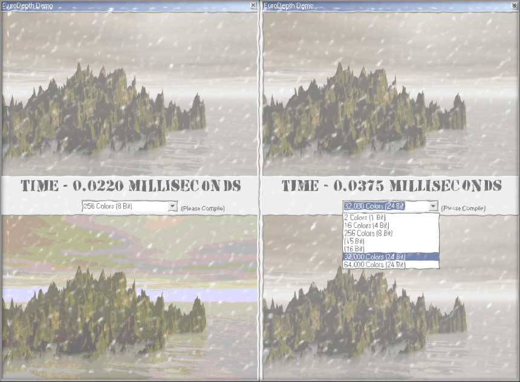



## EuroDepth 2\.0 \(Now Handles 1, 4, 8, 15, 16, 24\(32\), 24\(64\) bit depth's\) SUPER FAST\! See Screen Shot\!

### Description

This is a major improvement from version 1. When compiled it can change the bit depth in 0.02-0.08 milleseconds! Version 1 supported 1, 4, 8, 24(32k), 24(64k) bit depth's. Due to feedback I decided to add 15 and 16 bit depth's and redo all the code. The code is a lot cleaner, organized, and optimized to remove unnecessary repetition. MUST SEE! Please leave feedback, if you like it please vote. Enjoy! -James-
 
### More Info
 

             |
---                |---
**Submitted On**   |2002-10-24 14:52:18
**By**             |[James Dougherty](https://github.com/Planet-Source-Code/PSCIndex/blob/master/ByAuthor/james-dougherty.md)
**Level**          |Advanced
**User Rating**    |5.0 (15 globes from 3 users)
**Compatibility**  |VB 6\.0
**Category**       |[Graphics](https://github.com/Planet-Source-Code/PSCIndex/blob/master/ByCategory/graphics__1-46.md)
**World**          |[Visual Basic](https://github.com/Planet-Source-Code/PSCIndex/blob/master/ByWorld/visual-basic.md)
**Archive File**   |[EuroDepth\_148663102420\.zip](https://github.com/Planet-Source-Code/james-dougherty-eurodepth-2-0-now-handles-1-4-8-15-16-24-32-24-64-bit-depth-s-super-fast-s__1-40125/archive/master.zip)

